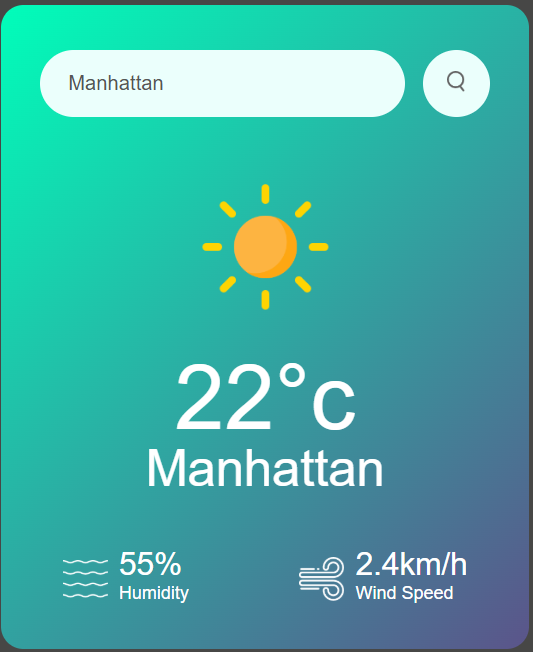

# 🌤️ Weather App

A simple and responsive weather app that fetches real-time weather data using the OpenWeatherMap API.

## Features

- Search weather by city name
- Displays:
  - Temperature
  - Weather condition
  - Humidity
  - Wind speed
- Real-time data from OpenWeatherMap API
- Clean and responsive design

##  Tech Stack

- HTML5
- CSS3
- JavaScript 
- OpenWeatherMap API


 

##  Setup Instructions

1. **Clone the repository**
```bash
 https://github.com/amit-mndal/Climatrack-weather-.git


